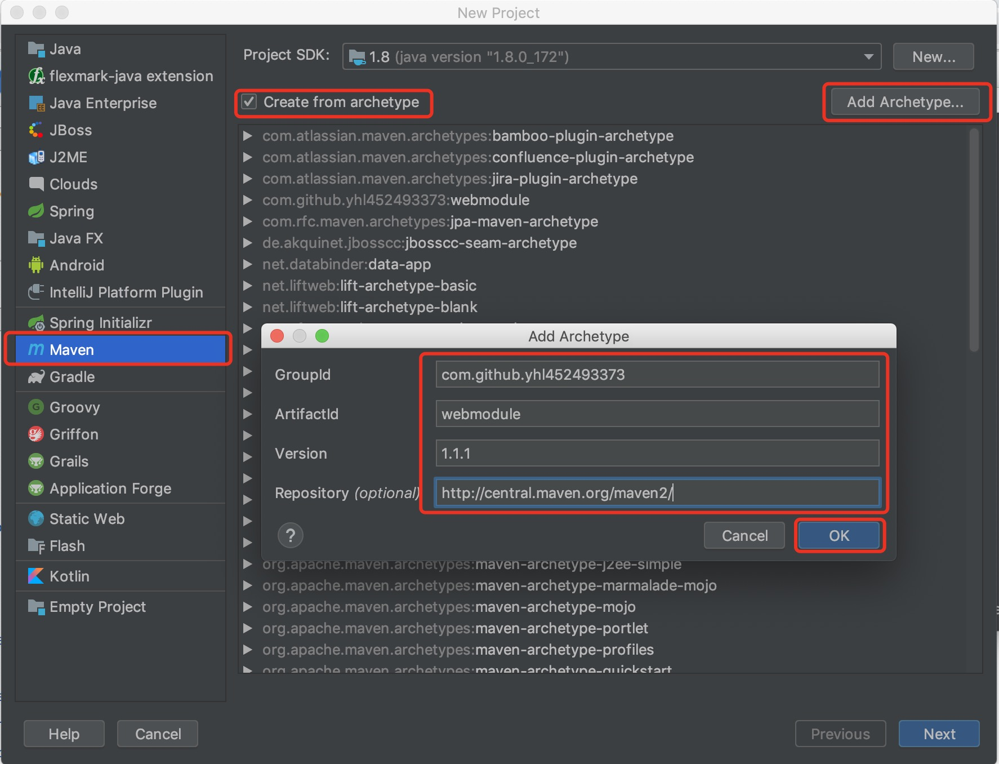

# 当前最新版本是1.1.6，请在添加archetype的时候做对应修改
# IDEA中添加archetype方法

---
# 自行修改编译方法
webmodule目录下执行archetype:create-from-project
target/generated-sources/archetype目录下执行clean install

之后在maven库中找到com/github/webmodule/1.1.1/webmodule-1.1.1.jar,用压缩软件打开(不要解压),
修改META-INF/maven/archetype-metadata.xml:
将
```xml
    <fileSet filtered="true" packaged="true" encoding="UTF-8">
      <directory>src/main/java</directory>
      <includes>
        <include>**/*.java</include>
      </includes>
    </fileSet>
```
修改为
```xml
    <fileSet filtered="true" packaged="true" encoding="UTF-8">
      <directory>src/main/java</directory>
      <includes>
        <include>**/**</include>
      </includes>
    </fileSet>
```
将
```xml
    <fileSet encoding="UTF-8">
      <directory>src/main/resources</directory>
      <includes>
        <include>**/*.ftl</include>
        <include>**/*.yml</include>
      </includes>
    </fileSet>
```
修改为
```xml
    <fileSet filtered="true" encoding="UTF-8">
      <directory>src/main/resources</directory>
      <includes>
        <include>**/**</include>
      </includes>
    </fileSet>
```
在archetype-resources/src/main/java/__artifactId__目录下新建config,mapper,service目录,之后保存
然后就能在maven或者idea中使用生成的archetype了
